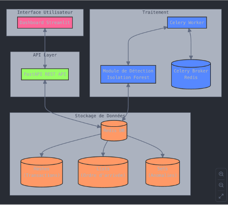

# Projet d'Analyse et de Détection d'Anomalies sur les Transactions Financières avec Redis

## Description du projet
Ce projet vise à développer une solution permettant l'analyse et la détection d'anomalies dans des transactions financières en utilisant **Redis** comme base de données en mémoire, **FastAPI** pour l'exposition des données via API, **Celery** pour l'automatisation des tâches, et **Streamlit** pour la visualisation des résultats. L'objectif est d'offrir une approche rapide et efficace pour stocker, analyser et surveiller les transactions, avec un accent particulier sur la détection des comportements frauduleux.

---

## Architecture de la solution

L'architecture de la solution repose sur les composants suivants :

1. **Stockage des données avec Redis :**
   - Importation des transactions à partir d'un fichier CSV.
   - Stockage sous forme de hachage (hashes) pour un accès rapide et efficace.
   - Utilisation d'UUID pour assurer l'unicité des transactions.
   - Application d'un TTL (Time-To-Live) pour simuler une gestion de session utilisateur.

2. **Exposition des données via FastAPI :**
   - Mise à disposition d'API REST pour récupérer et filtrer les transactions.
   - Gestion des requêtes utilisateur en temps réel.

3. **Détection d'anomalies avec Machine Learning :**
   - Utilisation de l'algorithme Isolation Forest pour identifier les transactions suspectes.
   - Stockage des anomalies détectées dans Redis pour un suivi ultérieur.
   - Automatisation de la détection via Celery.

4. **Visualisation avec Streamlit :**
   - Tableaux et graphiques interactifs pour analyser les tendances des transactions.
   - Affichage des anomalies détectées en temps réel.

---

## Prérequis

Avant d'exécuter le projet, assurez-vous d'avoir installé les dépendances requises :

1. **Python 3.x** (vérifiez avec `python --version`)
2. **Redis** (installé via Homebrew sur macOS : `brew install redis`)
3. **Modules Python nécessaires :**
   ```bash
   pip install -r requirements.txt
   ```

---

## Installation

1. **Cloner le projet :**
   ```bash
   git clone https://github.com/mon-projet-redis.git
   cd mon-projet-redis
   ```

2. **Créer un environnement virtuel et l'activer :**
   ```bash
   python -m venv myenv
   source myenv/bin/activate  # macOS/Linux
   myenv\Scripts\activate  # Windows
   ```

3. **Installer les dépendances :**
   ```bash
   pip install -r requirements.txt
   ```

4. **Lancer Redis :**
   ```bash
   brew services start redis  # Pour macOS
   redis-server  # Autre méthode manuelle
   ```

---

## Exécution du projet

### 1. Stockage des données dans Redis
Exécuter le script pour importer les transactions depuis le fichier CSV :

```bash
python store_transactions.py
```
*Sortie attendue :*  
`Transactions stockées avec succès.`

---

### 2. Démarrage de l'API FastAPI
Lancer le serveur API pour récupérer les données stockées :

```bash
uvicorn api:app --reload
```
Accéder à la documentation interactive via Swagger UI :  
👉 `http://127.0.0.1:8000/docs`

---

### 3. Lancer la détection des anomalies
Exécuter le script d'analyse des anomalies avec Celery :

```bash
celery -A tasks worker --loglevel=info
```

---

### 4. Vérification des anomalies détectées dans Redis
Pour afficher les anomalies détectées :

```bash
redis-cli
SMEMBERS anomalies
```

---

### 5. Lancer le tableau de bord Streamlit
Exécuter le tableau de bord pour visualiser les données et anomalies :

```bash
streamlit run dashboard.py
```
Accéder au tableau de bord via :  
👉 `http://localhost:8501`

---

## Surveillance des logs

Il est possible de suivre les logs des différents services pour ajuster les performances :

- **API FastAPI :**  
  ```bash
  uvicorn api:app --reload --log-level debug
  ```
- **Celery :**  
  ```bash
  celery -A tasks worker --loglevel=info
  ```
- **Streamlit :**  
  ```bash
  streamlit run dashboard.py --logger.level=debug
  ```

---

## Axes d'amélioration

Plusieurs axes d'amélioration sont envisagés :

- **Automatisation de l'ingestion des données** avec Kafka ou RabbitMQ pour assurer un flux continu.
- **Intégration de sources externes** via du scraping ou des API.
- **Migration vers le cloud** pour assurer la scalabilité et la résilience.
- **Sécurisation des données** avec OAuth 2.0 et conformité RGPD/PCI-DSS.

---

## Schéma de l'Architecture

Le schéma suivant illustre l'architecture du projet :



